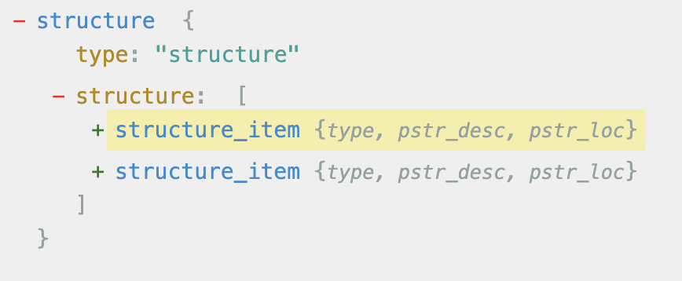
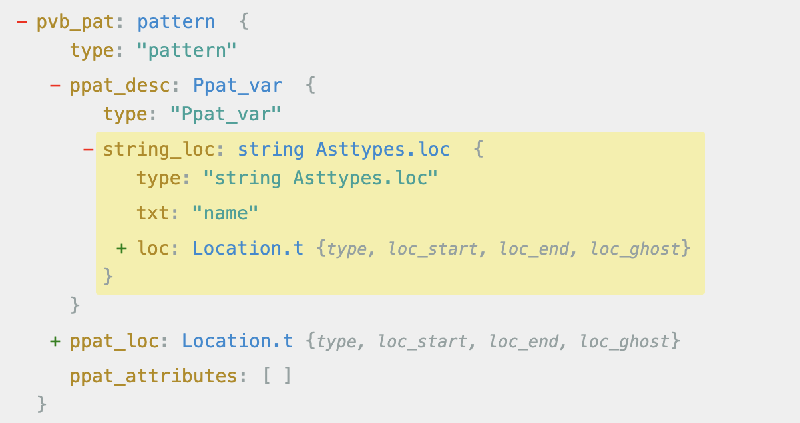

# Abstract Syntax Tree (AST)

### Table of Contents

- [Description](#description)
- [Why the AST Matters](#why-the-ast-matters)
- [Preprocessing in OCaml](#preprocessing-in-ocaml)

## Description

The Abstract Syntax Tree (AST) is a critical component in the OCaml compilation process. It represents the structure of the source code in a tree-like format, allowing for advanced code manipulations and transformations. This guide explores the importance of the AST, how it is used in preprocessing, and the different methods available for working with it through **PPX** (PreProcessor eXtensions).

### Why the AST Matters

With the AST, you can:

- **Manipulate the Program**: Modify the code by adding new functions, changing variable names, or performing linting.
- **Transform Code**: Use the AST to perform complex code transformations that are difficult to achieve at the source code level.

### Preprocessing in OCaml

Unlike some programming languages that have built-in preprocessing features—such as C's preprocessor or Rust's macro system—OCaml lacks an integrated macro system. Instead, it relies on standalone preprocessors.

The OCaml Platform officially supports a library for creating these preprocessors, which can operate at two levels:

- **Source Level**: Preprocessors work directly on the source code.
- **AST Level**: Preprocessors manipulate the AST, offering more powerful and flexible transformations.

> **⚠️ Warning**  
> One of the key challenges with working with the Parsetree (the AST in OCaml) is that its API is not stable. For instance, in the OCaml 4.13 release, significant changes were made to the Parsetree type, which can impact the compatibility of your preprocessing tools.

### AST Guide

This guide will concentrate on AST-level preprocessing using **PPX** (PreProcessor eXtensions), providing a comprehensive overview of the following topics:

1.  **AST Construction**: Learning how to build and manipulate ASTs.
2.  **AST Destructuring**: Breaking down ASTs into manageable components for advanced transformations.

### Why Should I Understand the AST?

OCaml's Parsetree can be confusing, verbose, and hard to understand, but it's a powerful tool that can help you write better code, understand how the compiler works, and develop your own PPXs.

You don't need to be an expert on it, but you should know a little about this structure, and the rest you can learn along the way. However, you must face the AST before getting further into PPXs.

For this, I'm going to use the [AST Explorer](https://astexplorer.net/) throughout the repository to help you understand the AST.

### First Look

By comparing code snippets with their AST representations, you'll better understand how OCaml interprets your code, which is essential for working with PPXs or delving into the compiler's internals. The AST Explorer tool will help make these concepts clearer and more accessible.

Let's take a quick look at the JSON AST representation of a simple OCaml expression:

```ocaml
(* Foo.ml *)
let name = "john doe"
```

```json
// AST Tree
{
  "type": "structure",
  "structure": [
    {
      "type": "structure_item",
      "pstr_desc": {
        "type": "Pstr_value",
        "rec_flag": {
          /* ... */
        },
        "value_bindings": [
          {
            "type": "value_binding",
            "pvb_pat": {
              "type": "pattern",
              "ppat_desc": {
                "type": "Ppat_var",
                "string_loc": {
                  "type": "string Asttypes.loc",
                  "txt": "name",
                  "loc": {
                    /* ... */
                  }
                }
              },
              "ppat_loc": {
                /* ... */
              }
            },
            "pvb_expr": {
              "type": "expression",
              "pexp_desc": {
                "type": "Pexp_constant",
                "constant": {
                  "type": "Pconst_string",
                  "string": "john doe",
                  "quotation_delimiter": {
                    /* ... */
                  }
                }
              },
              "pexp_loc": {
                /* ... */
              }
            },
            "pvb_loc": {
              /* ... */
            }
          }
        ]
      },
      "pstr_loc": {
        /* ... */
      }
    }
  ]
}
```

As you can see, it's a little bit verbose. Don't be scared; we are going to learn how to read it, which is the most important thing.

### Structure

In OCaml, a **module** serves as a container for grouping related definitions, such as types, values, functions, and even other modules, into a single cohesive unit. This modular approach helps organize your code, making it more manageable, reusable, and easier to understand.

A **structure** refers to the content within a module. It is composed of various declarations, known as **structure items**, which include:

- **Type definitions** (e.g., `type t = ...`)
- **`let` bindings** (e.g., `let x = 1`)
- **Function definitions**
- **Exception declarations**
- **Other nested modules**

The structure represents the body of the module, where all these items are defined and implemented. Since each `.ml` file is implicitly a module, the entire content of a file can be viewed as the structure of that module.

> **💡 Tip**      
> Every module in OCaml creates a new structure, and nested modules create nested structures.

Consider the following example:

```ocaml
(* Bar.ml *)
let name = "john doe"

module GameEnum = struct
  type t = Rock | Paper | Scissors

  let to_string = function
    | Rock -> "Rock"
    | Paper -> "Paper"
    | Scissors -> "Scissors"

  let from_string = function
    | "Rock" -> Rock
    | "Paper" -> Paper
    | "Scissors" -> Scissors
    | _ -> failwith "Invalid string"
end
```

```json
// AST Tree
{
  "type": "structure",
  "structure": [
    {
      "type": "structure_item",
      "pstr_desc": {
        /* ... */
      },
      "pstr_loc": {
        /* ... */
      }
    },
    {
      "type": "structure_item",
      "pstr_desc": {
        "type": "Pstr_module",
        "module_binding": {
          "type": "module_binding",
          "pmb_name": {
            /* ... */
          },
          "pmb_expr": {
            "type": "module_expr",
            "pmod_desc": {
              "type": "Pmod_structure",
              "structure": [
                {
                  "type": "structure_item",
                  "pstr_desc": {
                    /* ... */
                  }
                  /* ... */
                }
              ]
              /* ... */
            }
            /* ... */
          }
          /* ... */
        }
        /* ... */
      }
    }
  ]
}
```

As you can see, `Bar.ml` and `GameEnum` are modules, and their contents are **structures** that contain a list of **structure items**.

> **📝 Note**  
> A structure item can either represent a top-level expression, a type definition, a `let` definition, etc.

I'm not going to be able to cover all structure items, but you can find more about it in the [OCaml documentation](https://ocaml.org/learn/tutorials/modules.html). I strongly advise you to take a look at the [AST Explorer](https://astexplorer.net/) and play with it; it will help you a lot.

### Language Extensions and Attributes

As the AST represents the structure of the source code in a tree-like format, it also represents the Extension nodes and Attributes. It is mostly from the extension and attributes that the PPXs are built, so it's important to understand that they are part of the AST and have their own structure.

- **Extension nodes** are generic placeholders in the syntax tree. They are rejected by the type-checker and are intended to be “expanded” by external tools such as -ppx rewriters. On AST, it is represented as `string Ast_414.Asttypes.loc * payload`.

  For example, in the code `let x = [%foo]`, `[%foo]` is the extension node.

- **Attributes** are “decorations” of the syntax tree, which are mostly ignored by the type-checker but can be used by external tools.

  On AST, it is represented as `string Ast_414.Asttypes.loc * payload`.

  For example, in the code `type foo = A | B [@enum]`, `[@enum]` is the attribute of the `B` node. To be an attribute of the entire type, you must use `@@`: `[@@enum]`.

I know that it can be a lot, but don't worry; we are going step by step, and you are going to understand it.

### Samples

To understand a little bit more about the structure item, let's show it with some examples:

| Code                                          | AST                                                                      |
| --------------------------------------------- | ------------------------------------------------------------------------ |
|  |  |
|        |                         |

### [On the next section, we will learn how to build an AST.](./a%20-%20Building%20AST/README.md)